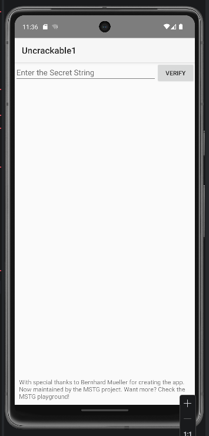
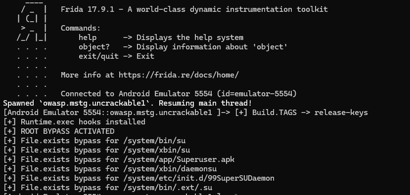
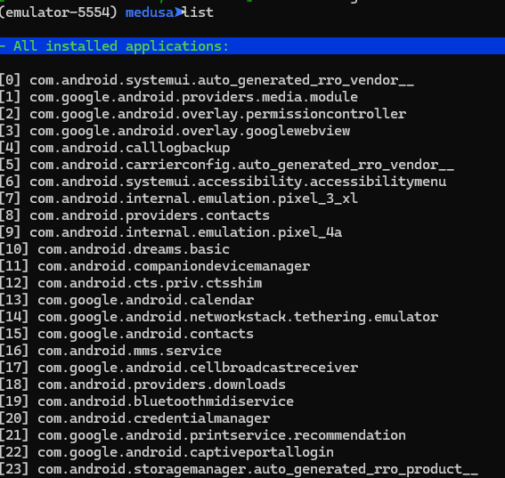

# Root Detection Bypass – Android

## Objectif

Contourner la détection de root dans l’application *OWASP Uncrackable Level 1*.

---
## Outils utilisés

* ADB
* Frida
* Medusa
* Android Emulator

---

## Étapes

### 1. Vérification

adb devices
frida --version

### 2. Lancement de frida-server

adb push frida-server /data/local/tmp/
adb shell chmod 755 /data/local/tmp/frida-server
adb shell /data/local/tmp/frida-server

### 3. Vérification des applications

frida-ps -uai

### 4. Bypass root

frida -U -f owasp.mstg.uncrackable1 -l bypass_root.js

Résultat :
Le root n’est plus détecté.

---

### 5. Utilisation de Medusa

py medusa.py
startserver
list

### Après (bypass réussi)

### Logs Frida

### Medusa

---

## Conclusion
Le bypass de la détection de root a été réalisé avec succès en utilisant Frida.
Medusa a permis de visualiser et analyser les applications.

